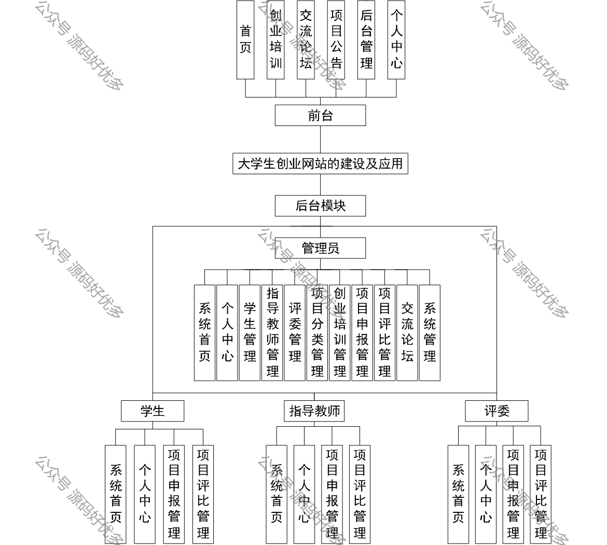
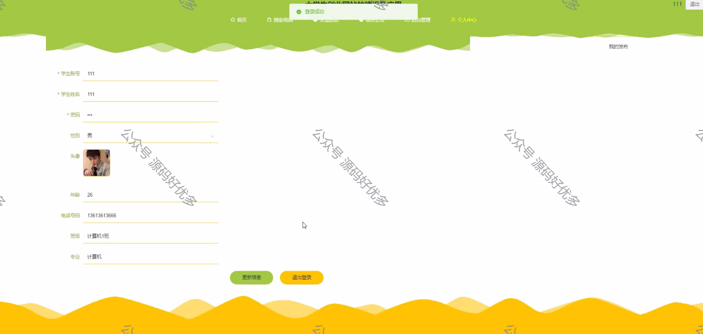
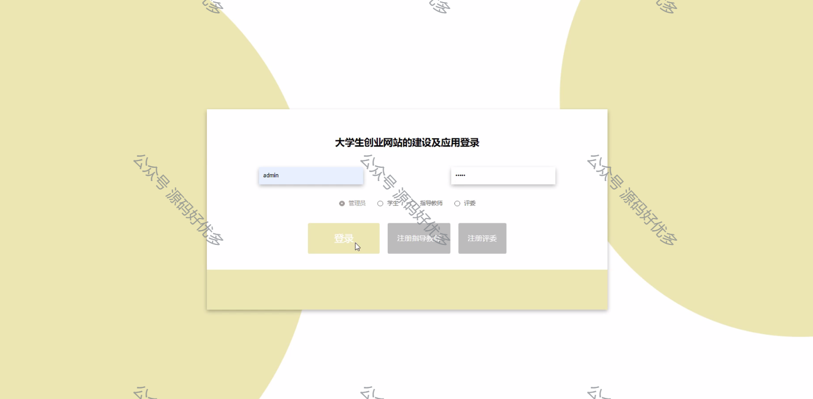
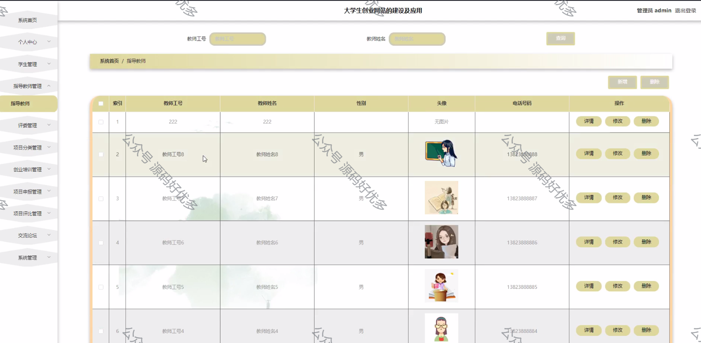
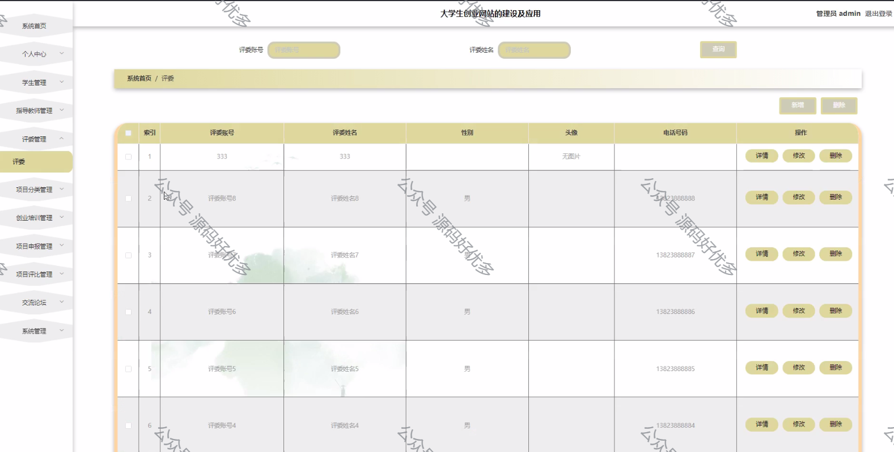
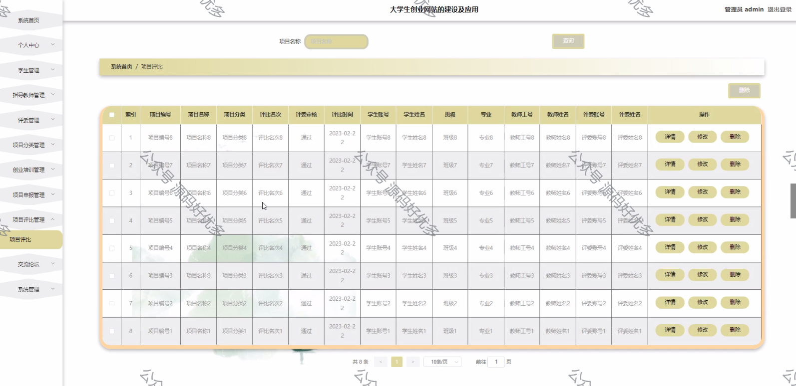
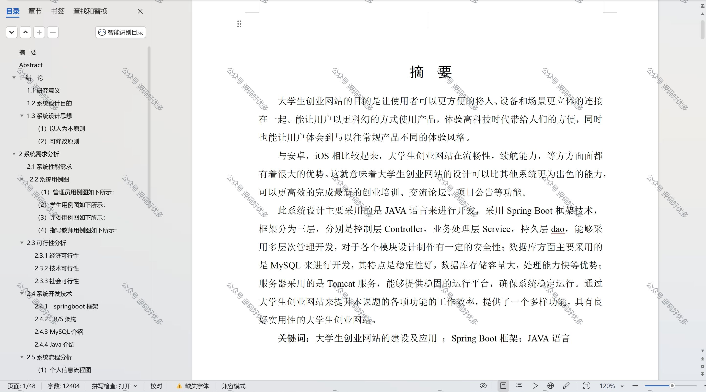

 
## 查看主页获取源码

> **作者介绍**： **✌**全网粉丝10W+本平台特邀作者、博客专家、CSDN新星计划导师、java领域优质创作者,博客之星、掘金/华为云/阿里云/InfoQ等平台优质作者、专注于项目实战 **✌**

  

### 一、作品包含

源码+数据库+设计文档万字+PPT+全套环境和工具资源+部署教程

### 二、项目技术

前端技术：Html、Css、Js、Vue、Element-ui

数据库：MySQL

后端技术：Java、Spring Boot、MyBatis

  

### 三、运行环境

开发工具：IDEA/eclipse

数据库：MySQL5.7

数据库管理工具：Navicat10以上版本

环境配置软件： JDK1.8+Maven3.6.3

前端Nodejs：14

### 四、项目介绍
项目编号：springbootA095

大学生创业网站是一个旨在激发学生创业热情、提供创业资源和信息交流平台的在线服务系统，它通过整合校内外资源，为有志于创业的大学生提供项目指导，以促进青年创业者的成长和创业项目的成功孵化。

包括前台、后台模块、管理员、学生、指导教师、评委等不同角色及其对应的功能。

前台包括首页、创业培训、交流论坛、项目公告、后台管理、个人中心等功能。
后台模块包括大学生创业网站的建设及应用、管理员、学生、指导教师、评委。
管理员包括系统首页、个人中心、学生管理、指导教师管理、评委管理、项目分类管理、创业培训管理、项目申报管理、项目评比管理、交流论坛、系统管理等功能。
学生包括系统首页、个人中心、项目申报管理、项目评比管理等功能。
指导教师包括系统首页、个人中心、项目申报管理、项目评比管理等功能。
评委包括系统首页、个人中心、项目申报管理、项目评比管理等功能。

### 五、运行截图

  
